I recently rebuilt my personal website. Not because it was broken — it
was working fine. But I had four reasons that, taken together, made a
compelling case.

First, I wanted to consolidate. The site was running on AWS — Rust
Lambda functions behind an API Gateway, with a static frontend served
from S3. But I had been steadily moving other applications to Azure, and
having one outlier on a separate cloud felt like unnecessary overhead.
One platform, one set of tooling, one billing dashboard.

Second, the backend language. I had originally built the Rust backend
when I was experimenting with the language. It was a solid learning
exercise, but I am fundamentally more comfortable in the JVM world.
Kotlin was the natural choice — easier to maintain, more aligned with my
daily work.

Third, the static site had real limitations. A purely static frontend
served from S3 has no server-side execution, which means no way to
dynamically use secrets. For a personal blog that is manageable, but it
bothered me architecturally. A proper web application gives you security
capabilities that a static site simply cannot offer.

And fourth — I wanted to see what AI-assisted development actually looks
like when applied to a real migration. Not a demo, not a side project
thrown together over a weekend, but a full stack rewrite: tear down the
old infrastructure, build the new one, and ship.

------------------------------------------------------------------------

## Setting up the rules

I did not hand Copilot a blank prompt and hope for the best. Before
writing any code, I set up explicit rules and guidelines: TDD, DDD,
SOLID principles, clean code, and established best practices.

This turned out to be the most important decision of the entire project.
The rules acted as constraints — they shaped every piece of code Copilot
produced, and gave me a way to evaluate whether the output was
acceptable without reviewing every line from scratch.

In practice, this meant Copilot was not just generating code. It was
generating code within a framework I had defined. The difference matters.

------------------------------------------------------------------------

## What AI actually did

The scope was significant. Copilot handled:

-   removing the existing AWS infrastructure\
-   rewriting the entire backend from Rust to Kotlin\
-   rewriting the frontend\
-   provisioning Azure infrastructure\
-   styling the terminal-inspired look and feel of the site

This is work that would have taken me weeks of evenings and weekends.
The core of the migration happened in a fraction of that time. The
mechanical work — translating logic between languages, writing
infrastructure configurations, building out components and styles — is
exactly where AI provides the most leverage.

------------------------------------------------------------------------

## Where I had to step in

AI handled execution well. It did not handle judgment.

On the UI side, Copilot could produce layouts and components, but it
could not match the specific visual intent I had in mind. The
corrections were frequent — small adjustments that individually seem
trivial but collectively determine whether a site feels considered or
generic.

Then there was cost. The initial architecture Copilot produced included a
provisioned PostgreSQL database — a reasonable default for a web
application, but entirely wrong for a personal blog with minimal traffic.
I replaced it with plain Markdown files stored on Azure Blob Storage and
opted for a scale-to-zero model with cold starts instead of keeping
resources running continuously. That single decision eliminated the
largest line item in the monthly bill.

Which introduced the next problem: performance. A Kotlin web application
on Azure, scaling from zero, has a cold start problem. The first request
after an idle period hits a JVM that needs to warm up, and the user pays
for that latency.

Copilot did not flag either of these. I did. And the solution —
pre-rendering static content for the latest twenty articles so the site
always has something to serve instantly — was an architectural decision
that came from understanding the runtime behavior, the cost trade-off,
and the operational model. These were not coding problems. They were
judgment calls.

------------------------------------------------------------------------

## What it looks like

The result is a system with clear separation of concerns. The article
content lives in its own repository, independent of the application
code. A publishing pipeline bridges the two — syncing articles to
Azure Blob Storage and triggering deployments through the application
repository.

Here is how the infrastructure fits together:

And here is how the application components interact at runtime:

The frontend is a React SPA served behind Nginx, which also handles
bot detection for SEO pre-rendering and proxies API requests to the
backend. The Kotlin backend reads article content from Blob Storage,
parses Markdown to HTML, and serves it through a REST API with a
sixty-minute cache. Static data for the most recent articles is
pre-generated at build time so the site loads instantly — even when the
backend is cold.

None of this is novel. But arriving at this architecture — and the
trade-offs it represents — required decisions that AI did not make.

------------------------------------------------------------------------

## What this taught me

The rebuild confirmed something I had been suspecting: execution is
becoming cheap. The effort to go from "I know what I want" to "it exists
and it works" is compressing rapidly. AI handles the translation from
intent to implementation with increasing competence.

But the decisions that frame the work — what to build, what to
constrain, what trade-offs to accept — those remain entirely human. And
as execution gets cheaper, those decisions become more visible. A poor
architectural choice propagates faster when there is no implementation
friction to slow it down.

The rules I set up front were not just about code quality. They were
about maintaining control over a process that moves fast enough to
outrun your ability to review it. Without those constraints, I would
have spent more time correcting AI output than writing the code myself.

------------------------------------------------------------------------

## Closing

This is my first blog post. The website it is published on is also the
project it describes —  test-edit which feels appropriate.

If there is one takeaway, it is this: AI is a powerful execution engine,
but it runs on the judgment you feed it. Define your constraints clearly,
set your standards explicitly, and do not confuse speed of output with
quality of decisions.

Execution is cheap now. Judgment is not.